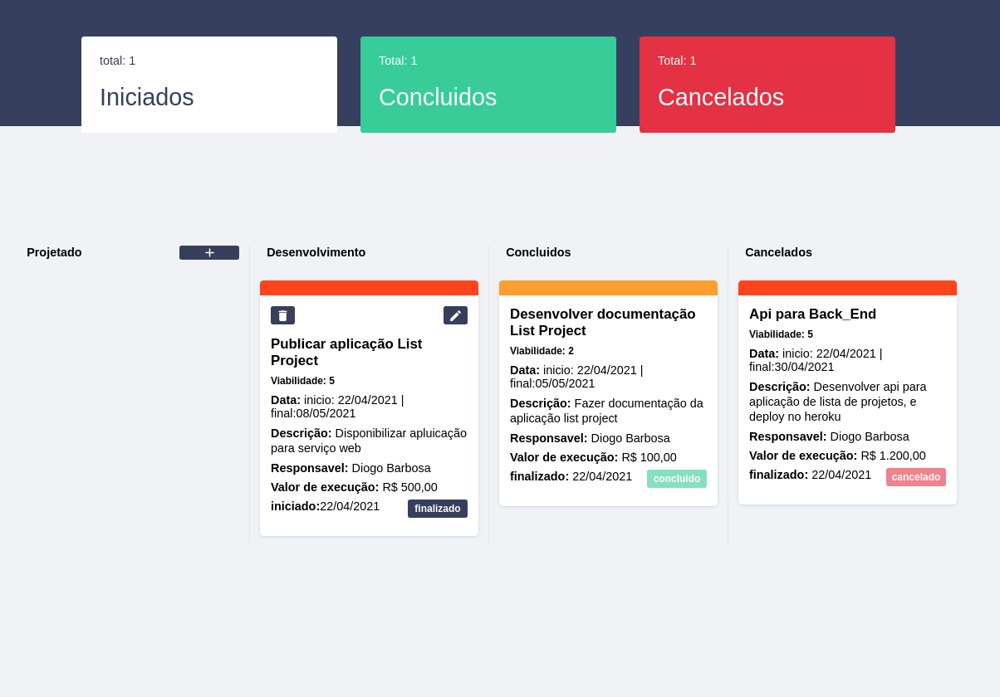
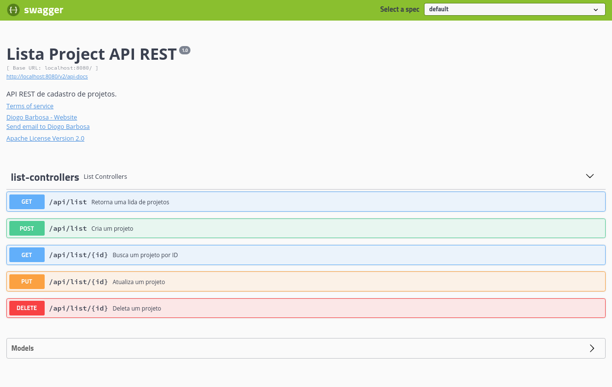

<div>
  <h1 align="center">LIST_PROJECT</h1>
  
  <div align="center">

  <a href="#sobre">Sobre</a> 
    |
  <a href="#tecnologias">Tecnólogias</a>
    |
  <a href="#dependencias">Utilizar projeto</a>
    |
  <a href="#Projeto">Pagina do projeto</a>

  </div>
</div>

<div >
<ul align="center">
  
  
</ul>

</div>


<div>
  <h3>Sobre.</h3>
  <h4 id="sobre">
  <b>Desenvolvido com REACT,</b>
    Aplicação com objetivo de oorganizar projetos do dia, onde tem acompanhamento do fluxo de status de cada projeto. O mesmo aborda descrição viabilidade e titulo do projeto.</h4>

  
</div>


<div id="tecnologias">
  <h3>Tecnológias.</h3>
  <ul>
    <li>
      <a href="https://pt-br.reactjs.org/docs/getting-started.html">REACT.Js
      </a>
    </li>
    <li>
      <a href="https://github.com/reactjs/react-modal">
        React-Modal.
      </a>
    </li>
    <li>
      <a href="https://fkhadra.github.io/react-toastify/introduction">
        React-toastify.
      </a>
    </li>
    <li>
      <a href="https://github.com/styled-components/styled-components">    
        Styled-components.
      </a>
    </li>
    <li>
      <a href="https://www.typescriptlang.org/">
        TypeScript.
      </a>
    </li>
    <li>
      <a href="https://nodejs.org/pt-br/docs/">
        NODE.JS.
      </a>
    </li>
    <li>
      <a href="https://classic.yarnpkg.com/en/docs/">
        YARN.
      </a>
    </li>
  </ul>
  
</div>

<div id="dependencias">

<h3>Baixar Projeto.</h3>  

```bash
# Clone this repository
$ git clone https://github.com/FullBarbosa/DesafioHelo.git LIST_PROJECT

# Install dependencies Yarn
$ yarn install

# Install dependencies NPM
$ npm install 
```
</div>
 <div id="dependencias">
 <h3>Disponivél o front da aplicação na vercel</h3>  
    <a href="https://desafio-helo.vercel.app/">
    
    </a>

<p>Para utilização da aplicação é necessario utilizar um serviço local</p>
    <a href="https://github.com/FullBarbosa/FullBarbosa-BackEndApiProjectHeloo">
    
    </a>
    <p>Siga a documentação da api para utilizar a aplicação</p>
</div>

